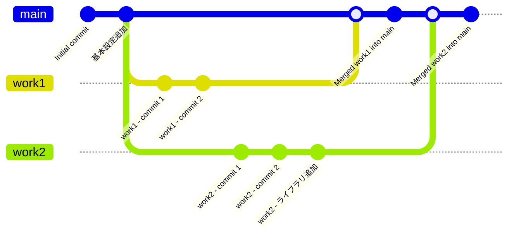

# Git

##### ブランチ(branch)

ブランチは、Gitの中で独立した作業を行うための機能。
ブランチを使うことで、並行で開発することができます



主に使うコマンド
```
# ブランチを表示する
git branch
# 全てのブランチ(リモートブランチ含め)を表示する
git branch -a
```

##### スタッシュ(stash) 

スタッシュは、作業中の変更を一時的に保存するための機能。
スタッシュを使うことで、作業中の変更を一時的に保存し、他の作業に切り替えることができます  
※ある機能を実装している途中で、別の機能を先に実装する必要が出てきた場合などに便利です

主に使うコマンド
```
# スタッシュを保存する
git stash
# untrackedなファイルもスタッシュする
git stash -u
# メッセージを付けてスタッシュを保存する
git stash save "メッセージ"
# スタッシュで保存した一覧を表示する
git stash list
# スタッシュを適用する
git stash apply
# スタッシュを適用して、スタッシュを削除する
git stash pop
# スタッシュを削除する
git stash drop
```

##### コミット(commit)
コミットは、変更を記録するための機能。

主なコマンド
```
# メッセージを付けてコミットする
git commit -m "コミットメッセージ"
# メッセージはエディターを開いて入力する
git commit
# 最新のコミットを修正する
git commit --amend
```

##### プル(pull)

プルは、リモートリポジトリの変更をローカルに取り込むための機能。
git pullは、git fetchとgit mergeを組み合わせたコマンドです。


##### フェッチ(fetch)

フェッチは、リモートリポジトリの取得を行うための機能。

##### マージ(merge)

マージは、異なるブランチの変更を統合するための機能。


##### リバート(revert)
リバートは特定のコミットを打ち消すコミットを作成するための機能。

※リリースしたけどバグが見つかって前のバージョンに戻したい場合などにリバートを使います。


##### リベース(rebase)

コミット履歴を整理するための機能。
※作業コミットをレビュー出す前に整理したい場合などにリベースを使います。既存のブランチの履歴をリベースで操作はしないようにしましょう。


主なコマンド
```
git pull
git fetch
git merge <取り込むbranch_name>
git revert <commit_hash>
# インタラクティブにリベースする
git rebase -i
```


##### リセット(reset)
リセットは、コミットを取り消すための機能。

主なコマンド
```
# コミットを取り消す
# --soft: コミットを取り消し、変更をステージングエリアに戻す
# --mixed: コミットを取り消し、変更をワーキングツリーに戻す
# --hard: コミットを取り消し、変更を完全に削除する
git reset --soft <commit_hash or 参照名(HEAD^など)>
git reset --mixed <commit_hash or 参照名(HEAD^など)>
git reset --hard <commit_hash or 参照名(HEAD^など)>
```


##### チェリーピック(cherry-pick)

チェリーピックは、特定のコミットを別のブランチに適用するための機能。

主なコマンド
```
# 特定のコミットを別のブランチに適用する
git cherry-pick <commit_hash>
```
