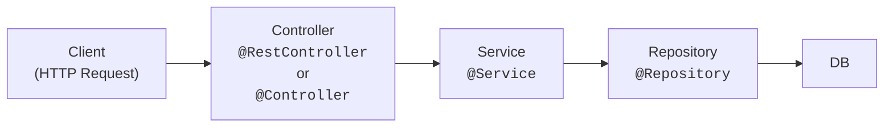

# SpringBoot 基本

SpringBootでWEBアプリケーションを作成する際は、
Controller, Service, Repositoryの3つのレイヤーに分けて実装することが一般的です。



## Controller
ControllerはHTTPリクエストを受け取り、入力値のバリデーションやレスポンスの生成を行います。

```java

// RestControllerはレスポンスのオブジェクトをJSON形式で返す ※ StringやintなどはJSON形式で返さない
// WebAPIを作成する場合は@RestControllerを使用
@RestController
@RequestMapping("/api") // このControllerのURLのベースパス
public class SampleController {
    @Autowired
    private SampleService sampleService;

    @GetMapping("/sample")
    public SampleResponse getSample(@RequestParam String id) {
        SampleResponse response = sampleService.getSample(id);
        return response;
    }
}

// ControllerはHTMLを返す
@Controller
@RequestMapping("/user")
public class UserController {
    @Autowired
    private UserService userService;

    @GetMapping("/profile")
    public String getUserProfile(@RequestParam String id, Model model) {
        User user = userService.getUser(id);
        model.addAttribute("user", user);
        return "user/profile"; // Thymeleafテンプレートのパス resources/templates/user/profile.htmlを見る
    }
}
```

## Service
Serviceはビジネスロジックを実装します。
```java
@Service
public class SampleService {
    @Autowired
    private SampleRepository sampleRepository;

    @Autowired
    private SampleHistoricalRepository sampleHistoricalRepository;

    public SampleResponse getSample(String id) {
        SampleEntity entity = sampleRepository.findById(id);
        sampleHistoricalRepository.saveAccessHistory(entity.toHistorical());
        SampleResponse response = new SampleResponse(
                entity.getId(),
                entity.getName(),
                entity.getDescription()
        );
        return response;
    }
}
```

## Repository
Repositoryは主にデータベースとのやり取りを行います。外部APIとのやり取りを行う場合もRepositoryを使用することがあります。
```java

@Repository
public class SampleRepository {
    @Autowired
    private JdbcTemplate jdbcTemplate;

    public SampleEntity findById(String id) {
        String sql = "SELECT * FROM sample WHERE id = ?";
        return jdbcTemplate.queryForObject(sql, new Object[]{id}, new BeanPropertyRowMapper<>(SampleEntity.class));
    }
}
```

## Lombok
LombokはJavaのボイラープレート(定型)コードを削減するためのライブラリです。

```java
@Controller
@RequestMapping("/user")
public class UserController {
    
    private final UserService userService;

    // 引数のあるコンストラクタを1つのみ持つ場合は、@Autowiredは不要
    // コンストラクタインジェクション　※推奨
    // フィールドでAutowiredなどでDIするケースはフィールドインジェクション
    public UserController(UserService userService) {
        this.userService = userService;
    }

    @GetMapping("/profile")
    public String getUserProfile(@RequestParam String id, Model model) {
        User user = userService.getUser(id);
        model.addAttribute("user", user);
        return "user/profile";
    }
}

// 引数のあるコンストラクタを１つのみ持つ場合は、Springが自動的にAutowiredしてくれるため@Autowiredは不要
// 全てのフィールドを引数に持つコンストラクタを生成
@AllArgsConstructor
@Controller
@RequestMapping("/user")
public class UserController {
    
    private final UserService userService;

    @GetMapping("/profile")
    public String getUserProfile(@RequestParam String id, Model model) {
        User user = userService.getUser(id);
        model.addAttribute("user", user);
        return "user/profile";
    }
}

@ToString
@EqualsAndHashCode
@Getter
@AllArgsConstructor
public class User {
    private final String id;
    private final String name;
    private final String email;
}

@AllArgsConstructor: 全てのフィールドを引数に持つコンストラクタを生成
@RequiredArgsConstructor: finalを持つフィールドを引数に持つコンストラクタを生成
@NoArgsConstructor: 引数のないコンストラクタを生成
@ToString: toStringメソッドを生成
@EqualsAndHashCode: equals, hashCodeメソッドを生成
@Slf4j: ログ出力のためのフィールドを生成
@Data: getter, setter, toString, equals, hashCodeを生成
@Getter: getterを生成
@Setter: setterを生成
@Builder: Builderパターンを使用してオブジェクトを生成するためのメソッドを生成
```

参考：https://projectlombok.org/features/
