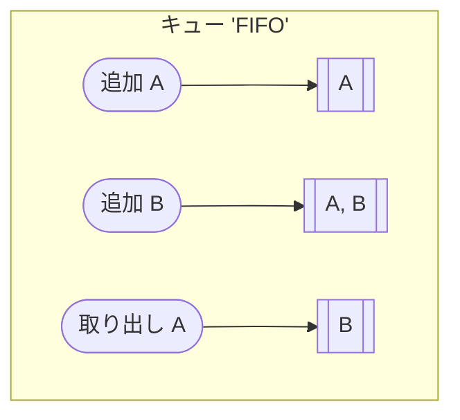
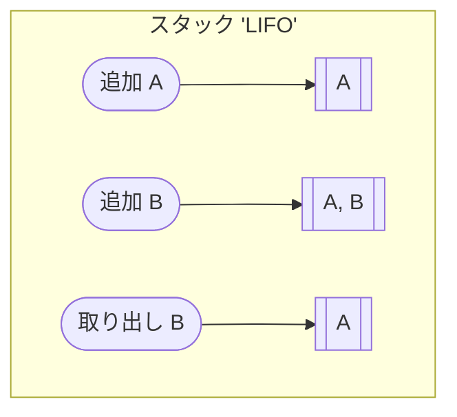

# コレクション
コレクションは、データの集合を効率的に操作・管理するために提供されているフレームワークの一部です。  
このフレームワークには、データ構造やアルゴリズムが実装されている様々なクラスやインターフェースが含まれています。

### 主要なコレクションインターフェイスとクラス
- List: 順序付きの要素の集合。重複を許す
  - ArrayList: アクセスが高速。デフォルトの選択肢
  - LinkedList: 末尾・先頭への追加・削除が高速。アクセスは順にたどるため遅い ※ Queue, Dequeインターフェイスも実装
- Set: 重複を許さない集合。順序は保証されない
  - HashSet: ハッシュテーブルを使用。順序は保証されない
  - TreeSet: 自然順序または指定された順序でソートされたセット
- Map: キーと値のペアの集合。重複を許さない
  - HashMap: ハッシュテーブルを使用。順序は保証されない
  - TreeMap: 自然順序または指定された順序でソートされたマップ
- Queue: FIFO（先入れ先出し）順序の要素の集合 ※ スタックはLIFO（後入れ先出し）
- Deque: 両端キュー。先頭と末尾の両方から要素を追加・削除できる

※ ハッシュテーブルの利点：通常は順番に見ていくが、ハッシュテーブルは計算式を使って直接アクセスできるため、データの取得が早い。  

※ コレクションはスレッドセーフではないため、スレッドセーフなコレクションを使用するか、外部で同期を行う必要がある。  
  - スレッドセーフなコレクションの例: `java.util.concurrent`パッケージに含まれるクラス（`ConcurrentHashMap`など）




例
```java
List<String> arrayList = new ArrayList<>(Arrays.asList("A", "B", "C"));
arrayList.get(0);
List<String> linkedList = new LinkedList<>(Arrays.asList("A", "B", "C"));
// 先頭取得のAPIが用意されている
linkedList.getFirst();

Set<String> hashSet = new HashSet<>(Arrays.asList("A", "B", "C", "C"));
Set<String> treeSet = new TreeSet<>(Arrays.asList("A", "B", "C", "C"));
hashSet.size(); // 3
treeSet.size(); // 3

Map<String, String> hashMap = new HashMap<>();
Map<String, String> treeMap = new TreeMap<>();
// キーを指定して値を取得
hashMap.get("key");
treeMap.get("key");
```
