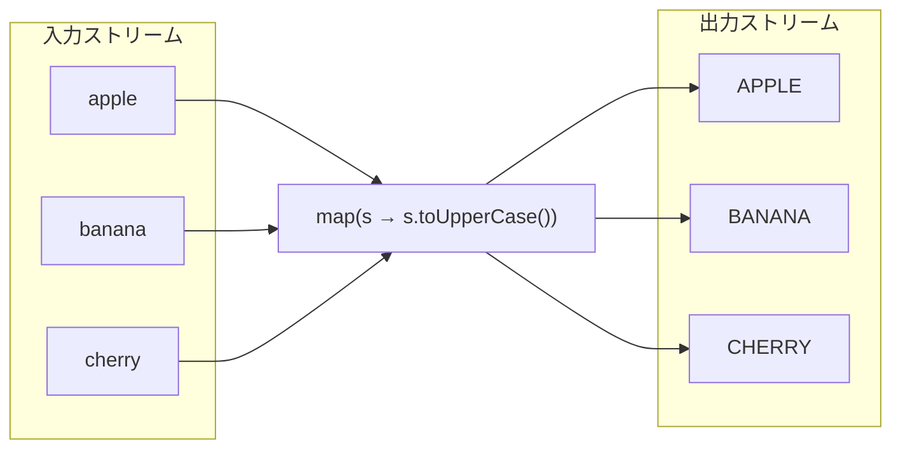
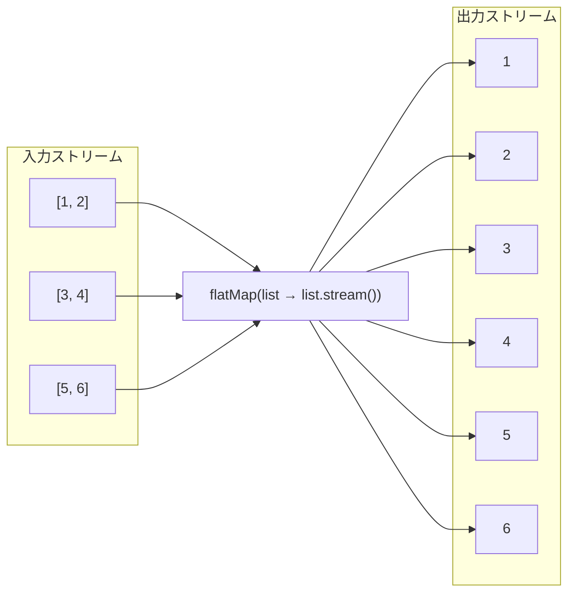

# ラムダ・ストリームAPI

ラムダ式：関数型インターフェイスの代替として使えるもの  
※ 関数型インターフェイス: 1つの抽象メソッドを持つインターフェイス
```java
List<Student> list = new ArrayList<>();
list.add(new Student("Alice", 100));

// ->　の前後部分のコードがラムダ式
// studentListの要素を1つずつ取り出し、student.getName()を出力
studentList.forEach(student -> System.out.println(student.getName()));

// studentListの要素を1つずつ取り出し、student.getName()でソート
studentList.sort((student1, student2) -> student1.getName().compareTo(student2.getName()));

// 従来のコードで書き直す 匿名クラス
studentList.forEach(new Consumer<Student>() {
    @Override
    public void accept(Student student) {
        System.out.println(student.getName());
    }
});

studentList.sort(new Comparator<Student>() {
    @Override
    public int compare(Student student1, Student student2) {
        return student1.getName().compareTo(student2.getName());
    }
});
```

ラムダ式の基本文法: ( 引数 ) -> { 処理 }  
関数型インターフェイスから実装すべきメソッドと引数の型がわかるため、引数の型を省略できる


ArrayListクラスのforEachメソッドはConsumerという関数型インターフェイスを引数に取る  
引数を1つ受け取り、戻り値がないメソッドを表す
https://docs.oracle.com/javase/jp/17/docs/api/java.base/java/util/ArrayList.html#forEach(java.util.function.Consumer)

ListインターフェイスのsortメソッドはComparatorという関数型インターフェイスを引数に取る  
引数を2つ受け取り、戻り値がint型のメソッドを表す
https://docs.oracle.com/javase/jp/17/docs/api/java.base/java/util/Comparator.html

メソッド参照：ラムダ式の簡略化。代入先の関数型インターフェイスの引数の数と型が一致していれば、メソッド参照を使える
```
List<Student> list = new ArrayList<>();
list.add(new Student("Alice", 100));

// メソッド参照
// System.out.println()メソッドは引数を1つ受け取り、戻り値がないメソッドであるため、Consumerインターフェイスに適合する
list.forEach(System.out::println);
```

----

Stream API：コレクションや配列など要素の集合を操作するためのAPI

```java
List<Student> list = new ArrayList<>();
list.add(new Student("Alice", 100));

// stream()メソッドでStreamインスタンスを取得
list.stream()
    // filterメソッドで条件に合致する要素を抽出
    .filter(student -> student.getScore() >= 60)
    // forEachメソッドで要素を1つずつ取り出し、student.getName()を出力
    .forEach(student -> System.out.println(student.getName()));
```


ストリームは生成、要素を操作する中間操作、結果を取得する終端操作の３ステップに分けられます

ストリームで何ができるか知ることが重要
https://docs.oracle.com/javase/jp/17/docs/api/java.base/java/util/stream/Stream.html

生成

中間操作
- filter：条件に合致する要素を抽出
- map：要素を変換
- sorted：要素をソート

終端操作
- forEach：要素を1つずつ取り出し、処理
- collect：要素を集めて新しいコレクションを作成


Stream APIのメリット
- コードの可読性の向上
- データの安全性。イミュータブルな操作
- パフォーマンスの向上。並列処理が可能、必要なデータのみ処理するため

```java
// Streamインスタンスの生成
String[] arr = new String[]{"a", "b", "c"};
Stream<String> stream = Arrays.stream(arr);

Stream<String> stream = Stream.of("a", "b", "c");
Stream<String> streamEmpty = Stream.empty();

List<String> list = List.of("a", "b", "c");
Stream<String> stream = list.stream();

Stream<String> streamBuilder = Stream.<String>builder().add("a").add("b").add("c").build();
Stream<String> streamGenerated = Stream.generate(() -> "element").limit(10);
Stream<Integer> streamIterated = Stream.iterate(40, n -> n + 2).limit(20);

Stream<String> streamOfString = Pattern.compile(", ").splitAsStream("a, b, c");

// DoubleStreamインスタンスの生成
Random random = new Random();
DoubleStream doubleStream = random.doubles(3);

// IntStreamインスタンスの生成
IntStream streamOfChars = "abc".chars();
IntStream intStream = IntStream.range(1, 5); // 1から4までの整数を生成


// ## 使用例 ##
 
// 並列処理
list.parallelStream().forEach(element -> doWork(element));

// 重複を除去したカウント
long count = list.stream().distinct().count();

// 条件に合致する要素があるかどうか
boolean isExist = list.stream().anyMatch(element -> element.contains("a"));

// reduce
Integer reduced = list.stream().reduce(23, (a, b) -> a + b);

// 大文字に変換して新しいリストを作成
List<String> resultList = list.stream().map(element -> element.toUpperCase()).collect(Collectors.toList());

// 1つ目の要素をスキップし、2文字目から3文字目までを取得し、ソートしてカウント
long size = list.stream()
        .skip(1)
        .map(element -> element.substring(0, 3))
        .sorted()
        .count();

// 2を含む要素を取得し、大文字に変換し、最初の要素を取得
Optional<String> stream = list.stream().filter(element -> {
    log.info("filter() was called");
    return element.contains("2");
}).map(element -> {
    log.info("map() was called");
    return element.toUpperCase();
}).findFirst();

 // ProductクラスのgetName()メソッドを呼び出し、カンマ区切りの文字列に変換
String listToString = productList.stream().map(Product::getName).collect(Collectors.joining(", ", "[", "]"));

// java17 toList()メソッド
List<String> list = productList.stream().map(Product::getName).toList();

// Orderリストが与えられているとする
List<Order> orders = ...;
// 全注文のItemを平坦化し、商品ごとに数量を合計する
Map<String, Integer> totalCountPerProduct = orders.stream()
    .flatMap(order -> order.getItems().stream())  // 各注文のItemを一つのStreamに平坦化
    .collect(Collectors.groupingBy(
        item -> item.getName(),                  // 商品名をグループのキーに
        Collectors.summingInt(item -> item.getQuantity()) // 数量を集計
    ));

```

mapメソッドのイメージ


flatMapメソッドのイメージ


参考
* https://www.baeldung.com/java-8-streams
